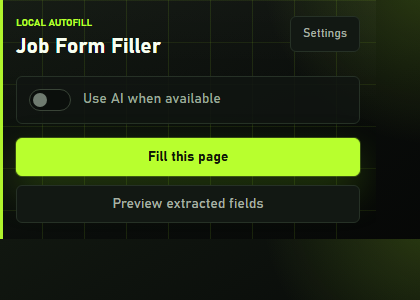
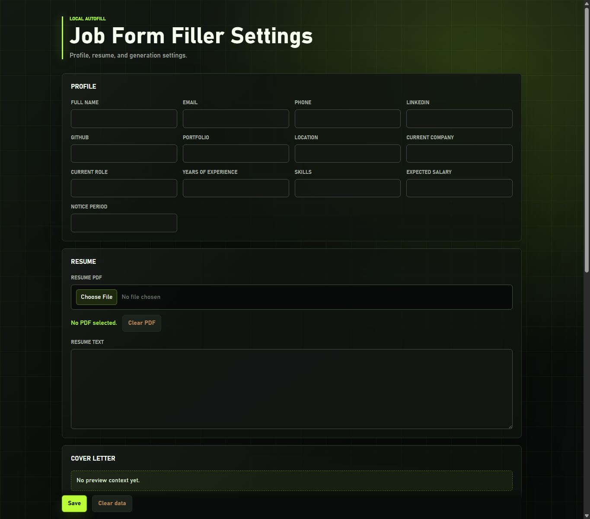

# Agent SDK Job Form Filler

A Chrome extension MVP that detects fields on job application pages, maps them to a saved candidate profile, and fills the page for manual review. It also includes an optional cover-letter workflow and a small SDK pipeline that can be tested independently.

## Screenshots

| Popup card | Settings page |
| --- | --- |
|  |  |

## Features

- Detects input, textarea, select, checkbox, radio, and file fields on job forms.
- Uses rule-based profile mapping by default.
- Optionally uses OpenAI-compatible generation when an API key is saved in the extension settings.
- Stores profile, resume text, resume PDF, and settings in `chrome.storage.local`.
- Includes a demo job application page for manual testing.
- Ships popup, options, and DevTools panel surfaces.

## Getting Started

Install dependencies:

```bash
npm install
```

Run the local Vite dev server:

```bash
npm run dev
```

Build the extension and SDK:

```bash
npm run build
```

Run type checks:

```bash
npm run typecheck
```

Run tests:

```bash
npm test
```

## Load The Extension

1. Run `npm run build`.
2. Open `chrome://extensions`.
3. Enable Developer mode.
4. Choose Load unpacked.
5. Select the generated `dist` folder.

The source repository intentionally ignores `dist` and `dist-node`; rebuild them locally before loading the extension.

## Demo Page

Open [examples/job-application-demo.html](examples/job-application-demo.html) in Chrome after loading the extension. Use the popup to preview fields or fill the page.

## Optional AI Setup

Open the extension settings page and save an OpenAI API key plus model name. The key is stored only in `chrome.storage.local` for this MVP and is not committed to the repository.

## Project Structure

- `src/popup` - toolbar popup UI
- `src/options` - settings and cover-letter UI
- `src/content.ts` - page field extraction and fill execution
- `src/lib` - shared browser extension utilities
- `sdk/pipelines/job-application` - reusable job application mapping pipeline
- `tests` - Node test coverage for the SDK pipeline
- `public/icons` - Chrome extension icon assets

## GitHub Notes

This repo is ready to push as source code. Build artifacts, dependencies, logs, and local environment files are ignored. Add a remote with:

```bash
git remote add origin https://github.com/<owner>/<repo>.git
git push -u origin main
```
